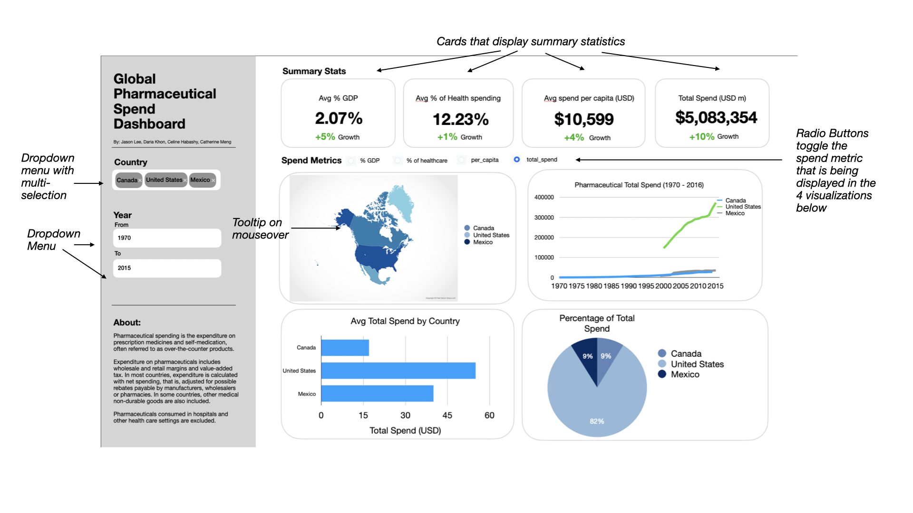

# Milestone 1 Proposal: Global Pharamaceutrical Spendings

Group 17: Jason Lee, Celine Habashy, Daria Khon, Catherine Meng

## Motivation and Purpose

**Our Role:** A healthcare economics consultancy specializing in data-driven policy analysis.

**Target Audience:** Health care administrators

Healthcare administrators worldwide are faced with the constant challenge of ensuring patient care quality along with the constraints of limited budgets and unpredictable supply chains. In Canada, the rising cost of pharmaceuticals has been a significant concern, with expenditures on pharmaceuticals consuming an increasingly large share of healthcare budgets over the past decade. For those managing hospitals, clinics, and regional health networks, these trends create operational risks—delays in securing essential drugs, strained budgets, and unstable supplier partnerships—that directly jeopardize their ability to provide reliable care.

This **Global Pharmaceutical Spendings** dashboard is designed to assist healthcare administrators by transforming scattered worldwide information into decision-ready intelligence for daily decision-making. During periods of supply disruption, administrators can look at historical data to identify persistent vulnerabilities and find alternatives. For administrators who are preparing annual budgets, the dashboard provides a view of long-term trends in spending. Being able to see how Canadian drug costs have persistently increased relative to other countries gives a foundation for renegotiating agreements with drug suppliers or revising formulary guidelines.

The **Global Pharmaceutical Spendings** dashboard addresses these challenges by providing an interactive platform that visualizes over 30 years of pharmaceutical expenditure data across 30+ countries to prioritize patient care outcomes. 

## Description of Data

## Research Questions

**Persona:** Christine Crudo, Senior Official at the Canadian Ministry of Health

Christine Crudo is responsible for developing and implementing policies related to public health regulations. They play a key role in shaping national health strategies and policies, ensuring regulatory compliance, and Canada's ability to proactively react to any health emergencies. Therefore, Christine could rely on the **Global Pharmaceutical Spendings** dashboard to gain insights on the following:
- Understand the current trends on the market for 'off-the-shelf' drugs
- Control Canadian healthcare costs
- Ensure supply chain integrity and stability
- Assessing holistic impact of the trends on the gloabl healthcare systems

#### User Story: Using the Global Pharmaceutical Spendings Dashboard

Christine is currently drafting a tax policy on imported drugs. They opens a dashboard to analyze historical and recent trends in global drug expenditures, performing the following tasks: 
1. **Filtering time data:** they set the time range to the last 20 years to focus on recent spending patterns.
2. **Comparing trends and statistics:** they look at the share of total health spending on pharmaceuticals worldwide, then narrow it down to North America, and then finally isolate Canada's data
3. **Geospatial Analysis:** they explore the distribution of pharmaceutical spending across different countries to identify high and low-expenditure regions and investigates their respective healthcare policies.

Based on their findings Christine identifies Luxemburg as a country with lowest expenditures in the last 20 years, and creates a task for them to investigate Luxemburg's tax policies. Moreover, Christine has numeric data to support the growth in spendings in the last 20 years in Canada that would influence the 2026 tax policy.

## App sketch & brief description

The app allows users to explore pharmaceutical expenditure trends across different countries over time. The dashboard features a multi-selection dropdown menu for selecting countries and a year range filter to adjust the analysis period. At the top, summary statistic cards display key spending metrics, such as average percentage of GDP spent on pharmaceuticals, percentage of health spending, spending per capita in USD, and total pharmaceutical spending in millions of USD. Growth trends for these metrics are also indicated. Users can toggle between different spend metrics using radio buttons, which modify the displayed data across four visualizations. Including a world map showing pharmaceutical spending intensity across selected countries. As well as a bar chart comparing total pharmaceutical spending by country, a line chart showing the historical trend of pharmaceutical expenditure from 1970 to 2018 and lastly, a pie chart representing the percentage breakdown of total pharmaceutical spending by country.The left panel of the dashboard has a short description that explains pharmaceutical spending. 
